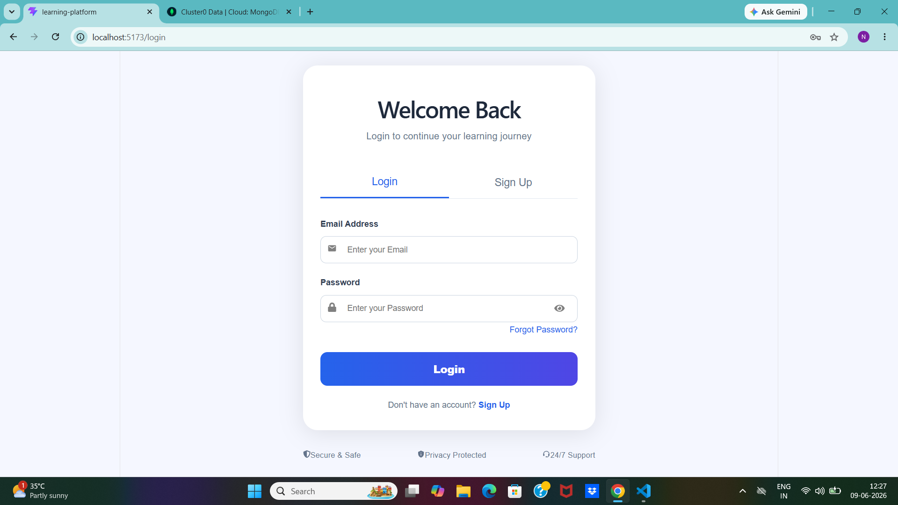
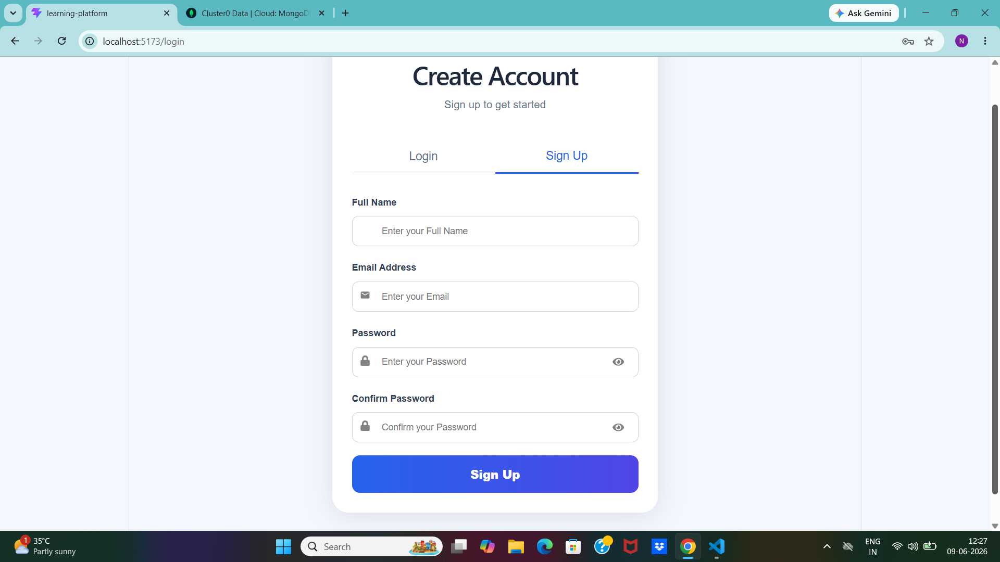
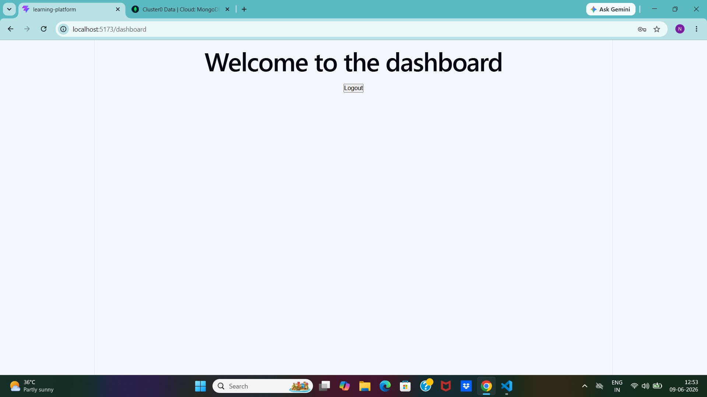

# Learning Platform Authentication System

## Overview

A full-stack authentication system built using React.js, Node.js, Express.js, MongoDB Atlas, JWT, and bcrypt.

This project allows users to register, log in securely, and access protected routes using JSON Web Tokens (JWT).

## Features

* User Registration
* User Login
* JWT Authentication
* Protected Dashboard Route
* Password Hashing with bcrypt
* MongoDB Atlas Integration
* Logout Functionality
* Token Expiration Validation

## Tech Stack

### Frontend

* React.js
* React Router DOM
* Axios
* React Icons

### Backend

* Node.js
* Express.js

### Database

* MongoDB Atlas
* Mongoose

### Authentication & Security

* JWT (JSON Web Token)
* bcrypt

## Project Structure

learning-platform/
│
├── backend/
│ ├── middleware/
│ ├── models/
│ └── server.js
│
├── src/
│ ├── components/
│ ├── pages/
│ └── App.jsx
│
└── README.md

## Installation

### Clone Repository

git clone <repository-url>

### Install Frontend Dependencies

npm install

### Install Backend Dependencies

cd backend
npm install

### Start Backend Server

npm start

### Start Frontend

npm run dev

## Screenshots

### Login Page

### Signup Page

### Dashboard

## Author

Nishitha Dheekollu
